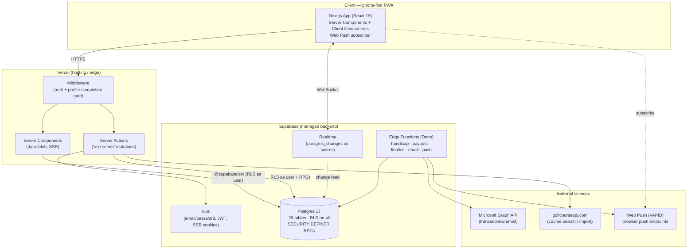
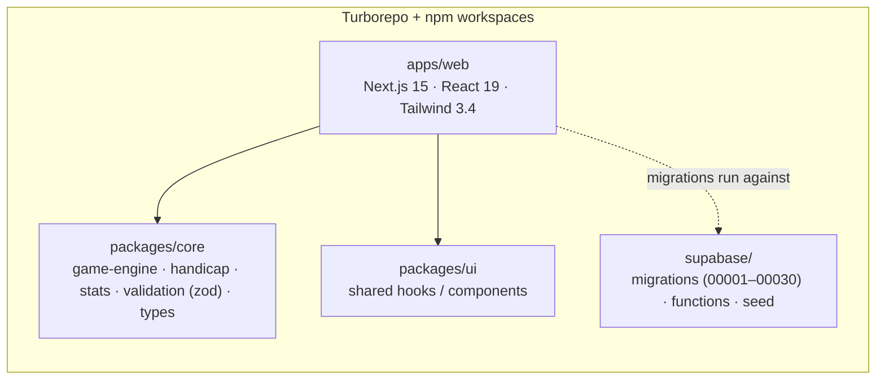
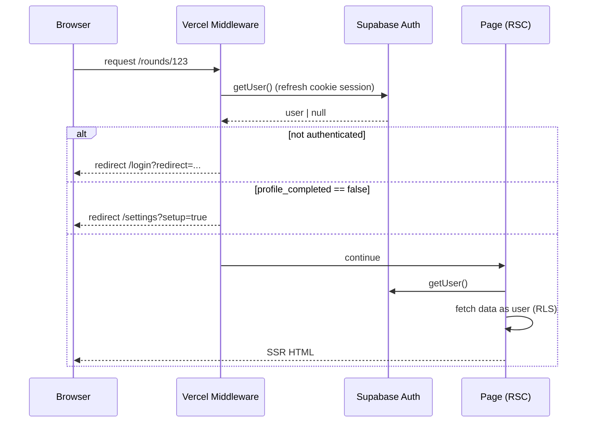
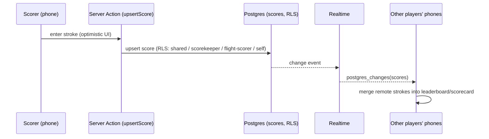
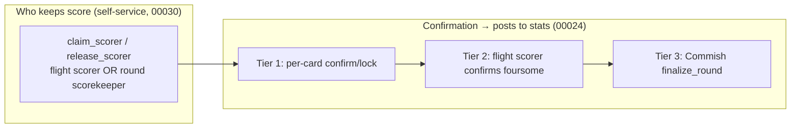
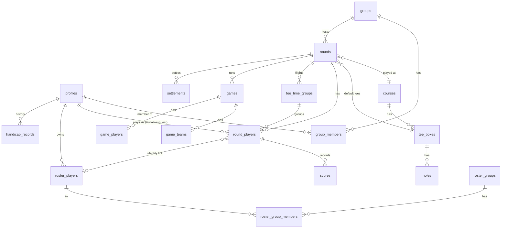
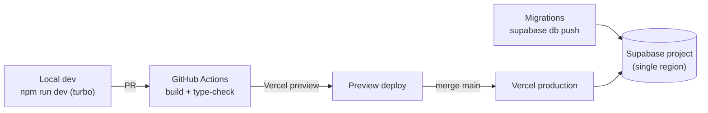

# Golf WWG — Architecture (current state)

_A snapshot of the system as built for beta, and a base for planning growth
afterward. Last updated: 2026-07-27 (30 migrations, through `00030`)._

Diagrams are [Mermaid](https://mermaid.js.org/) and render on GitHub. This doc
describes **what exists today**; the [Growth](#growth--scaling-post-beta)
section is explicitly forward-looking.

---

## 1. What it is

A phone-first golf app for tracking scores, running side games, and settling up
among friends. Three usage personas drive the product:

| Persona | "Job" | Status |
| --- | --- | --- |
| **A · Tee It Up Now** | Solo score + stat tracking | Live |
| **B · Game Time** | One round of side games with friends, join by GameID | Live |
| **C · Cup Time** | Multi-round Ryder-Cup style team events | Not built (Phase 3) |

Everything ships behind build-time feature flags (`NEXT_PUBLIC_FEATURE_*`,
default off), so unfinished work can land dark.

---

## 2. System context

**Key properties**

- **No custom backend server.** All server logic is either a Next.js Server
  Action/Component (on Vercel) or a Supabase Edge Function/RPC. The database is
  the security boundary.
- **RLS everywhere.** The app talks to Postgres _as the authenticated user_;
  Row-Level Security decides what each request can read/write. There is no
  service-role key in the browser or in committed config.
- **No anonymous access.** Even GameID joiners authenticate first (see §6).

---

## 3. Repository structure (Turborepo monorepo)

| Workspace | Contents | Notes |
| --- | --- | --- |
| `apps/web` | App Router pages, components, Server Actions, hooks, Supabase clients | The only deployable |
| `packages/core` | Framework-agnostic domain logic | `game-engine` (12 formats), `handicap` (USGA), `stats`, `validation` (zod schemas shared client+server), `types` |
| `packages/ui` | Shared UI/hooks | Thin today |
| `supabase/` | 30 SQL migrations, 5 Edge Functions, seed data | Sequential migrations are the source of truth for schema + RLS |

**App Router layout** (`apps/web/src/app`): `(auth)/` (login, register, reset,
invite), `(dashboard)/` (home, rounds, groups, courses, roster, game-time,
tee-it-up, join, settings, profile). Domain components live under
`src/components/{play,rounds,games,roster,layout,ui,...}`; server logic under
`src/lib/actions/*`.

---

## 4. Runtime flows

### 4.1 Auth + request gating

`apps/web/middleware.ts` → `lib/supabase/middleware.ts` refreshes the session on
every protected route and enforces the profile-completion gate.

### 4.2 Live scoring (the hot path)

- Score writes are gated by RLS (`00024`): a player may always write their own
  card; a flight scorer / whole-round scorekeeper may write the group's cards;
  writes are **blocked once a card is confirmed or the round is finalized**.
- Clients subscribe with `use-realtime-scores` and merge remote strokes while
  keeping local detailed stats.

### 4.3 Scoring authority & confirmation (three tiers)

---

## 5. Data model

Every table has RLS. Core play/scoring/roster domain:

**Table groups (29 total)**

- **Identity/org:** `profiles`, `groups`, `group_members`, `clubs`, `seasons`,
  `invitations`, `push_subscriptions`
- **Course:** `courses`, `tee_boxes`, `holes`
- **Round/scoring:** `rounds`, `round_players`, `tee_time_groups`, `scores`
- **Games/money:** `games`, `game_teams`, `game_players`, `settlements`
- **Roster (personal):** `roster_players`, `roster_groups`,
  `roster_group_members`
- **Handicap:** `handicap_records`

**Two group concepts (important for scaling):**

1. **`groups`** — shared org unit; also an auto-created hidden **personal group**
   per user (`is_personal`) so solo/Game-Time rounds have a home without RLS
   rewrites.
2. **`roster_players` / `roster_groups`** — a user's _private_ address book of
   people they play with (folders over the roster). `email` is the durable claim
   key that links a roster entry to a real account (`00029`).

---

## 6. Security model

- **RLS on every table.** Reads/writes are scoped by group membership,
  ownership, or self. Policies were hardened against recursion early
  (`00003`–`00006`).
- **`SECURITY DEFINER` RPCs** for the few operations that must cross a normal
  RLS boundary — always constrained to `auth.uid()`:
  - `get_or_create_personal_group`
  - `join_round_by_code`, `ensure_round_share_code` — GameID join adds the
    caller to the round's group so existing group-RLS covers them (no anon
    access, no policy rewrite).
  - `confirm_scorecard` / `confirm_flight` / `finalize_round` (+ unlock/unfinalize)
  - `claim_roster_by_email` — links unlinked roster entries to a new account and
    reconciles guest placeholders.
  - `claim_scorer` / `release_scorer` — self-service scoring.
- **Secrets** (Supabase service key, `GOLF_COURSE_API_KEY`, Azure/Graph creds,
  VAPID keys) live only in Vercel/Supabase env, never in committed `.env`.
  `.env.production` holds only non-secret feature flags.

---

## 7. Integrations & jobs

| Concern | How | Where |
| --- | --- | --- |
| Transactional email (invites, notifications) | Microsoft Graph API via Azure AD client-credentials | `lib/email.ts` + `send-invitation`, `send-round-notification` edge fns |
| Course data | golfcourseapi.com search/import | `lib/golf-course-api.ts`, `actions/courses.ts` |
| Push notifications | Web Push (VAPID) | `web-push`, `push_subscriptions`, `use-push-notifications`, `send-round-notification` |
| Handicap calc | USGA index | `packages/core/handicap` + `calculate-handicap` edge fn |
| Payouts | Per-format settlement | `calculate-payouts` edge fn + `game-engine` |
| Game engine (12 formats) | nassau, skins, wolf, best-ball, progressive-best-ball, match-play, stroke gross/net, alternate/mod-alternate shot, scramble, shamble | `packages/core/game-engine/formats` |

---

## 8. Deployment & environments

- **Frontend:** Vercel (preview per PR, production on `main`). CI gate = `build`
  (Next build) + `type-check`.
- **Database:** single Supabase project; schema evolves only via sequential
  migrations in `supabase/migrations` (`supabase db push`).
- **Config:** build-time `NEXT_PUBLIC_FEATURE_*` flags select what's live.

---

## 9. Growth & scaling (post-beta)

Forward-looking — not yet built. Ordered roughly by expected leverage.

### Product gaps to close first
- **Type C "Cup Time"** (multi-round team events) — the highest-retention
  persona, still unbuilt.
- **Missing game engines** surfaced as "coming soon": Stableford, Bingo-Bango-
  Bongo.
- **Dual-scoring reconciliation** — when two people score the same player, merge
  at confirmation.

### Platform / scale
- **Connection management.** RSC + Server Actions open many short-lived
  Postgres connections. Before load grows, standardize on Supabase's pooler
  (PgBouncer, transaction mode) and audit for N+1 query fan-out on hot pages
  (the round page already issues ~10 sequential queries — batch/denormalize).
- **Realtime fan-out.** Scoring broadcasts `postgres_changes` on `scores`.
  Validate per-round channel scoping and message volume for large fields/outings;
  consider broadcasting deltas rather than row events at scale.
- **RLS cost.** Some policies use `EXISTS` subqueries per row; profile the
  expensive ones (scores insert/update, group membership) and add supporting
  indexes / helper functions as the tables grow.
- **Background work.** Finalization, handicap, and payouts are on-demand edge
  functions; a queue (or `pg_cron` + a jobs table) would make them retryable and
  keep them off the request path.
- **Caching.** Course/tee/hole data is effectively static — add HTTP/Next cache
  layers and revalidation instead of re-querying per view.
- **Observability & limits.** Add structured logging/error tracking (Sentry-
  class), and extend the existing rate-limit helper to score writes and RPCs.
- **Multi-region / cost.** Single-region Postgres is fine for beta; revisit read
  replicas / region choice once the user base spreads geographically.
- **Testing.** Playwright is wired up — grow e2e coverage of the three persona
  flows (this repo has a companion `docs/test-pass.html` checklist) and add
  unit tests around the game engine and handicap math before they get more
  formats.

---

## 10. Where to look in the code

| Area | Path |
| --- | --- |
| Feature flags | `apps/web/src/lib/feature-flags.ts` |
| Server Actions | `apps/web/src/lib/actions/*` |
| Play experience | `apps/web/src/components/play/*`, `app/(dashboard)/rounds/[roundId]/play` |
| Supabase clients | `apps/web/src/lib/supabase/{server,client,middleware}.ts` |
| Schema + RLS + RPCs | `supabase/migrations/*` |
| Game engine | `packages/core/src/game-engine/*` |
| Related design docs | `docs/*` (roster, gameid-join, confirmation, course-tee editing) |
